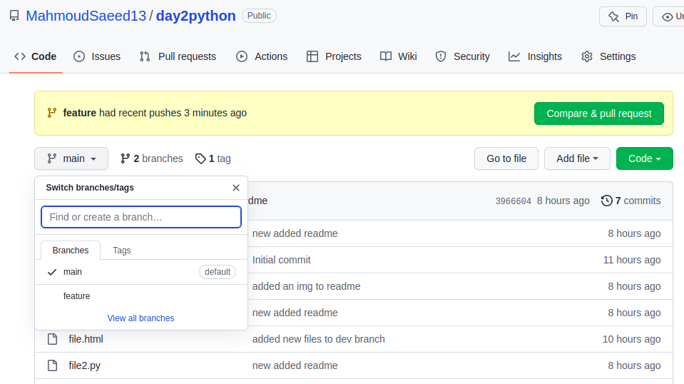
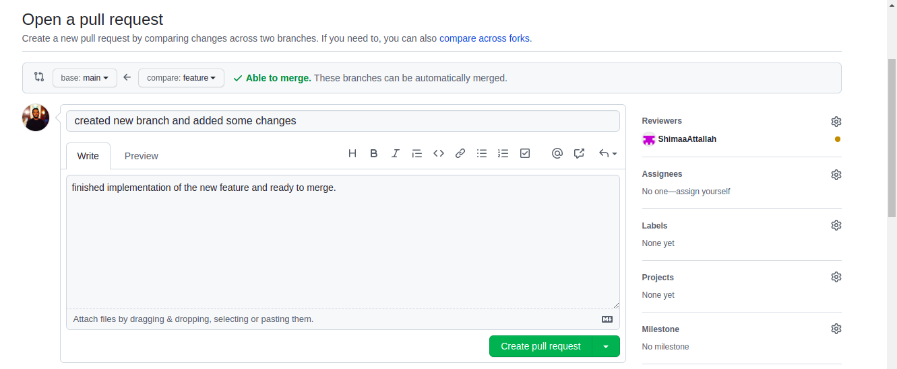
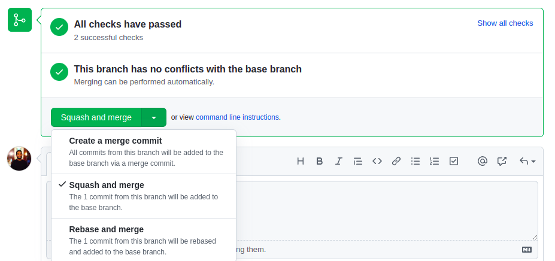
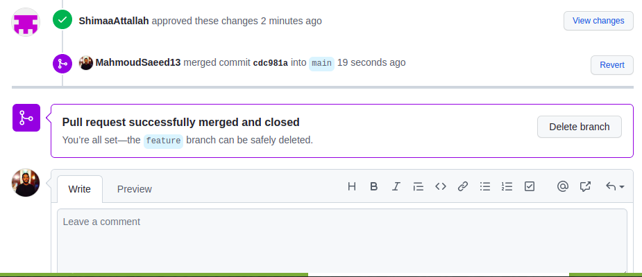
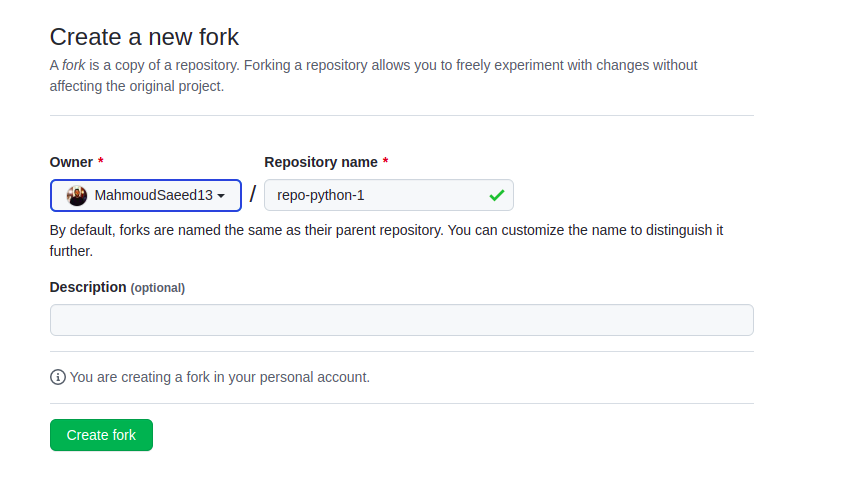
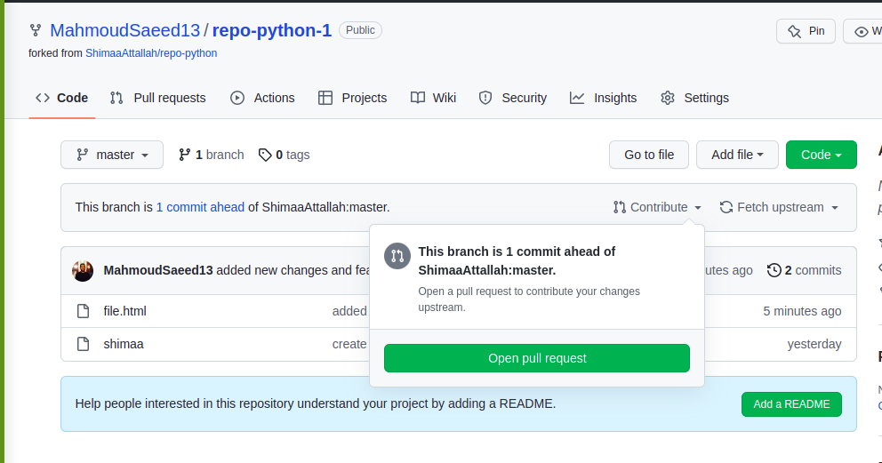
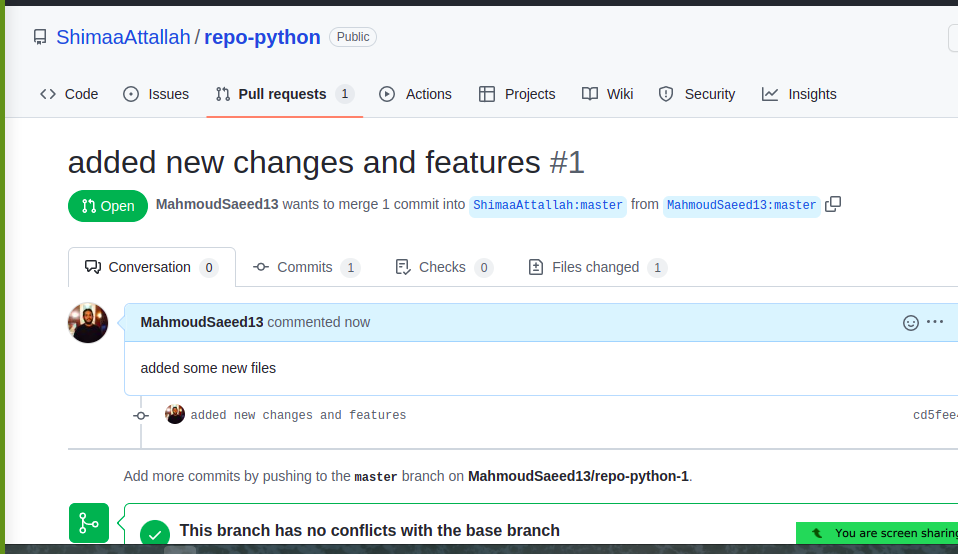
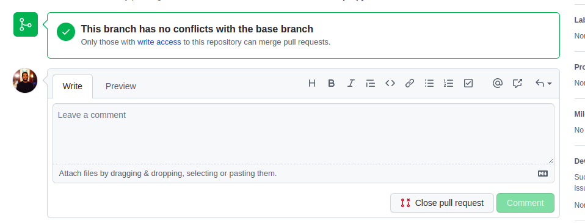
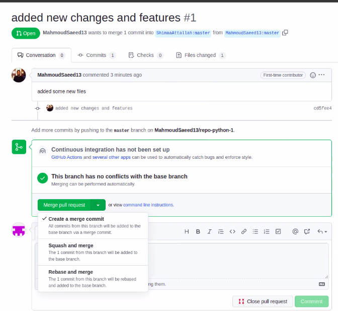

# Pull Request

A pull request or merge request as it's referred to soemtimes is the event that a developer make when ready to merge the new code into the main code of a project.

* Scenario of a team working on the project in the same repo 

First lets start with the case if a team of devolopers are working on a project in the same repo one of them created a branch to implement a new feature and after finishing he wants to merge it with the main branch here he creates a pull request so the leader engineer reviews the code and check that everything has been done perfectly and then approves to merge.

Here we will find that branch feature has changes to create a pull request we click the button on the right **compare & pull request** 

When opening the PR the developer can write a description to what he did and what is this PR about and also can put other devs who are working on the same project *of course his leader* to be reviewers like I added @ShimaaAttallah as a reviewer here 

An open disscution is open in the PR and the reviewers can give comments on the code and also can approve the merge.
The approach taken in reviewing the code and approvign and merging is a team desicion approach each team decide base on the project needs and their experince.

When the PR is approved from the reviewrs developer can merge the PR 

And this is how it looks after the successful merge 

* secnario of a pull request where the PR owner is not a contributor on th repo 

This scenario is what is made with open source contirbutions where developers add features or change something in a repo they don't own it.

first we fork the real repo

Then we clone the repo and add the changes we need and then push remotely to the forked repo online and we will see that it is ahead of the real repo and the open PR button is enalbled.

Then we will get to a page similar to that when we created a PR on the previous example we add a description and create the PR.

Then we will be taken to the real repo with the PR opened and needs to be approved from the owner.

We only have the ability to close PR in this kind of PRs beacause the owner has full authority on merging and approving PR into their repo.

The owner will get the PR and they can review, comment, approve or close PR

