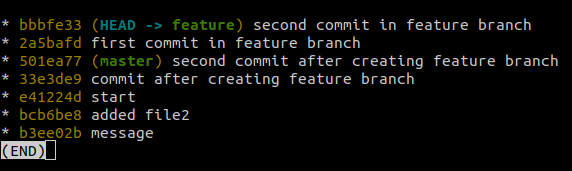
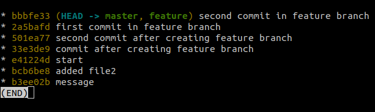

# Rebase

Rebasing is simply removing or combinig a suquence of coomits to a new base commit.
rebasing is changing the base of your branch from one commit to another making it appear as if you'd created your branch from a different commit. 

Internally, Git accomplishes this by creating new commits and applying them to the specified base. It's very important to understand that even though the branch looks the same, it's composed of entirely new commits.

# Usage

We'll take the case where a feature branch is made from a commit ***the commit start here*** from the master branch and while the feature branch is advancing with two commits the master branch is adcvancing too with another two commits, so when showing the branch tree we will notice that after the commit start the branch feature is created and had two commits and the branch master had two more commits of it's own.
```
git log --all --graph --decorate --oneline
```


The idea here is to rebase the two branches to make the feature branch start from the last commit in the master branch and also merge the changes on the feature branch into the master branch.

After runnig the following commands we will switch into the feature branch and rebase it to start from the last commit in the master branch which is ***second commit after creatning the feature branch***

```
git switch feature
git rebase master
```

When showing the branch tree it will look like that



the feature branch now starts from the last commit in the master branch and it is two commits ahead of it so we want to do the same to the master branch to kind of merge the changes on the feature branch into the master branch.

when switching to the master branch now and runnig the rebase command again 

```
git switch master
git rebase feature
```
and showing the branches tree it will look like that



Now both branches ar at the same level and all changes are merged into the master branch and we can push the changes to the remote repo if there is no problems.
